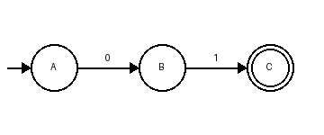

<!-- page 1 -->

# Sample exam

## Task 1 (4 points)

Compute the Laplace transform of \(f(t) = e^{-2t}\).

## Task 2 (6 points)

The figure shows a finite automaton over the alphabet \(\{0, 1\}\).

a) Which words of length two does it accept?

b) Draw an automaton for the reversed language.

## Task 3 (5 points)

Sketch the Bode plot of \(G(s) = \frac{10}{s + 1}\).

<!-- page 2 -->

# Solutions

**Task 1:** \(F(s) = \frac{1}{s + 2}\)

**Task 2a:** only \(01\).

**Task 2b:** C →1→ B →0→ A, with C the start state and A accepting.

**Task 3:** A horizontal line at 20 dB up to \(\omega = 1\), then −20 dB per decade.
